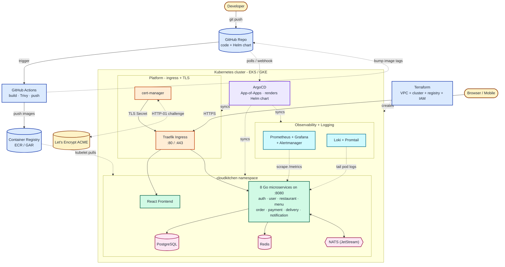
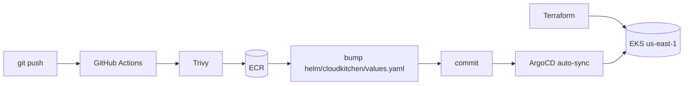

# CloudKitchen

[](.github/workflows)
[](https://go.dev)
[](https://react.dev)
[](https://aws.amazon.com/eks/)
[](https://argo-cd.readthedocs.io)
[](https://www.terraform.io)
[](LICENSE)

> A cloud-native, event-driven **food-delivery platform** built as 8 Go
> microservices plus a React frontend, deployed to **AWS EKS** via **GitOps**
> with a full observability and security baseline.

CloudKitchen is a portfolio-grade reference platform demonstrating microservice
design, async messaging, infrastructure-as-code, GitOps delivery, and
production-style monitoring/logging/security.

## What it is

- **8 backend microservices** (`auth`, `user`, `restaurant`, `menu`, `order`,
  `payment`, `delivery`, `notification`) written in Go, each listening on
  `:8080` and exposing `/metrics`, `/healthz`, `/readyz` with structured JSON logs.
- **React frontend** SPA served by nginx.
- **Sync** comms over REST, **async** comms over NATS JetStream events.
- Backed by **PostgreSQL**, **Redis**, and **NATS (JetStream)**.
- Shipped to **EKS** (`us-east-1`) through **GitHub Actions -> ECR -> ArgoCD**.

## Architecture



**Legend** — each colour groups one architectural concern:

| Colour | Category | Components |
|---|---|---|
| 🟡 Amber  | External actors           | Developer, end-user Browser, Let's Encrypt |
| 🔵 Blue   | Source / CI / Infra       | GitHub Repo, GitHub Actions, Container Registry, Terraform |
| 🟣 Purple | GitOps controller         | ArgoCD |
| 🟠 Orange | Ingress + TLS             | Traefik, cert-manager |
| 🟢 Green  | Application               | React frontend, 8 Go microservices |
| 🩷 Pink   | Data stores               | PostgreSQL, Redis, NATS JetStream |
| 🔷 Cyan   | Observability + Logging   | Prometheus + Grafana + Alertmanager, Loki + Promtail |

- **Infrastructure (Terraform).** One `terraform apply` provisions the VPC, Kubernetes cluster (GKE or EKS), container registry (Artifact Registry or ECR), and IAM — see `gcp-terraform/` and `terraform/`.
- **CI (GitHub Actions).** On every push to `main`: build all 9 Docker images in parallel, Trivy-scan them, push to the registry, and commit the new image tags back to `helm/cloudkitchen/values.yaml`.
- **CD (ArgoCD + Helm).** ArgoCD watches the repo, renders the umbrella Helm chart with the new tags, and reconciles every platform App via the **App-of-Apps** pattern — the application, the ingress layer, the monitoring stack, and the logging stack.
- **Ingress + TLS (Traefik + cert-manager).** Traefik serves traffic on `:80` / `:443`. cert-manager auto-renews a Let's Encrypt TLS certificate via the HTTP-01 challenge (renews every ~75 days).
- **Data plane.** React frontend at `/`; 8 Go services under `/api/*` listening on `:8080`. **PostgreSQL** is the system of record; **Redis** handles sessions/caching; **NATS JetStream** is the async event bus.
- **Observability.** Prometheus scrapes `/metrics` from every pod; Promtail tails container logs into Loki; Grafana queries both; Alertmanager handles fired alerts.

See [`docs/architecture/PHASE-1.md`](docs/architecture/PHASE-1.md) for the full design — event catalog, detailed CI/CD and GitOps diagrams, and the security baseline.

## Tech stack

| Layer            | Technology |
|------------------|------------|
| Backend services | Go 1.22 (HTTP REST, Prometheus client, structured JSON logging) |
| Frontend         | React 18 + Vite, served by nginx |
| Data store       | PostgreSQL 16 |
| Cache / sessions | Redis 7 |
| Messaging        | NATS 2.10 + JetStream (event bus) |
| Containers       | Docker (per-service Dockerfiles) |
| Orchestration    | Kubernetes (AWS EKS) |
| Ingress / TLS    | Traefik + cert-manager (Let's Encrypt) |
| GitOps           | ArgoCD |
| Packaging        | Helm |
| IaC              | Terraform (VPC, EKS, ECR, IAM/IRSA) — `us-east-1` |
| CI/CD            | GitHub Actions (matrix build, Trivy gate, ECR push, values bump) |
| Metrics          | Prometheus (kube-prometheus-stack) + Grafana |
| Logging          | Loki + Promtail |
| Security scan    | Trivy (CI gate + optional trivy-operator) |

## Repository layout (flat monorepo)

```
cloudkitchen-app/
├── auth/            # Go service — authentication & JWT
├── user/            # Go service — user profiles
├── restaurant/      # Go service — restaurant management
├── menu/            # Go service — menu items
├── order/           # Go service — order lifecycle
├── payment/         # Go service — payments
├── delivery/        # Go service — delivery tracking
├── notification/    # Go service — notifications
├── frontend/        # React SPA
├── helm/            # Helm chart(s)
├── terraform/       # AWS infra (VPC, EKS, ECR, IAM/IRSA)
├── argocd/          # ArgoCD Applications (App-of-Apps)
├── monitoring/      # Prometheus + Grafana values & dashboards
├── logging/         # Loki + Promtail values
├── security/        # cert-manager, network policies, PSS, trivy, secrets
├── docker/          # docker-compose local stack
├── scripts/         # build / seed / port-forward / kubeconfig helpers
├── docs/            # architecture & docs index
├── .github/         # GitHub Actions workflows
└── README.md
```

## Quickstart (local, docker-compose)

```sh
# from the repo root
docker compose -f docker/docker-compose.yml up --build
```

Then:

| Component    | URL                     |
|--------------|-------------------------|
| Frontend     | http://localhost:3000   |
| auth         | http://localhost:8081   |
| user         | http://localhost:8082   |
| restaurant   | http://localhost:8083   |
| menu         | http://localhost:8084   |
| order        | http://localhost:8085   |
| payment      | http://localhost:8086   |
| delivery     | http://localhost:8087   |
| notification | http://localhost:8088   |
| NATS monitor | http://localhost:8222   |

Seed demo data (users per role, a restaurant, menu items, an order):

```sh
./scripts/seed.sh
```

Full local instructions: [`docker/README.md`](docker/README.md).

## Deployment overview



1. **Provision** infrastructure with **Terraform** (VPC, EKS, ECR, IAM/IRSA) in
   `us-east-1`.
2. **Bootstrap** the cluster: namespaces, Traefik, cert-manager, ArgoCD,
   kube-prometheus-stack, Loki/Promtail.
3. **CI** (GitHub Actions): matrix build per service -> **Trivy** scan ->
   push to **ECR** -> bump image tags in `helm/cloudkitchen/values.yaml` ->
   commit. **No `helm upgrade` in CI.**
4. **GitOps**: **ArgoCD** detects the committed change and **auto-syncs** the
   Helm release to EKS.

See the area guides:
[monitoring](monitoring/README.md) ·
[logging](logging/README.md) ·
[security](security/README.md) ·
[docs index](docs/README.md).

## License

**CloudKitchen — Personal & Educational Use License** — see [LICENSE](LICENSE) for the full text.

Quick summary:

| | |
|---|---|
| ✅ **Free, no permission needed** | Clone, fork, run on your own laptop / cloud account for personal study. Modify for your own non-commercial use. Reference the architecture in your own work, with attribution. |
| ❌ **Permission required** | Videos / screencasts / livestreams / paid online courses / tutorials that feature this project. Books or paid newsletters that copy the code or docs. Any commercial reuse (selling, re-hosting as a paid service). |
| 📩 **Want to make educational content?** | Email **vijaygiduthuri67@gmail.com** with who you are, what you want to make, where you'll publish it, and whether it's paid or free. Educational creators with clear attribution are welcome. |

This project was built as a learning artifact for **cloud / DevOps / platform / SRE engineers** and stays free for that purpose. The restriction is on people repackaging it as their own content — not on you learning from it.

> Note: this is a **source-available** license, NOT an OSI-approved open-source license. The badge above reflects that.
