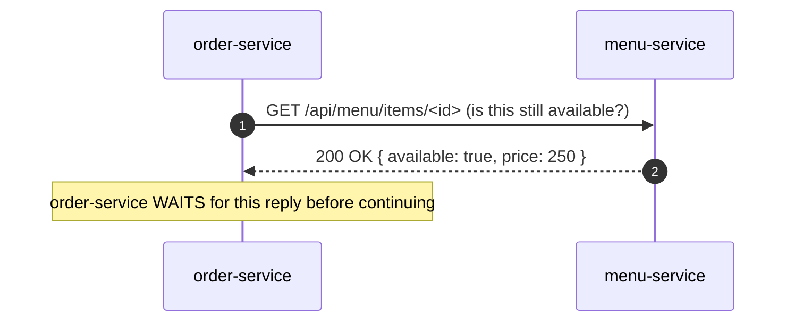
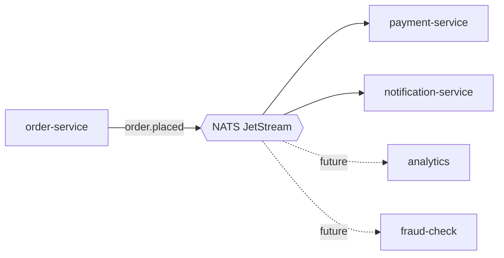
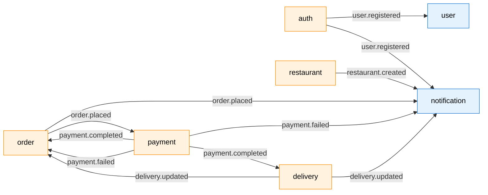
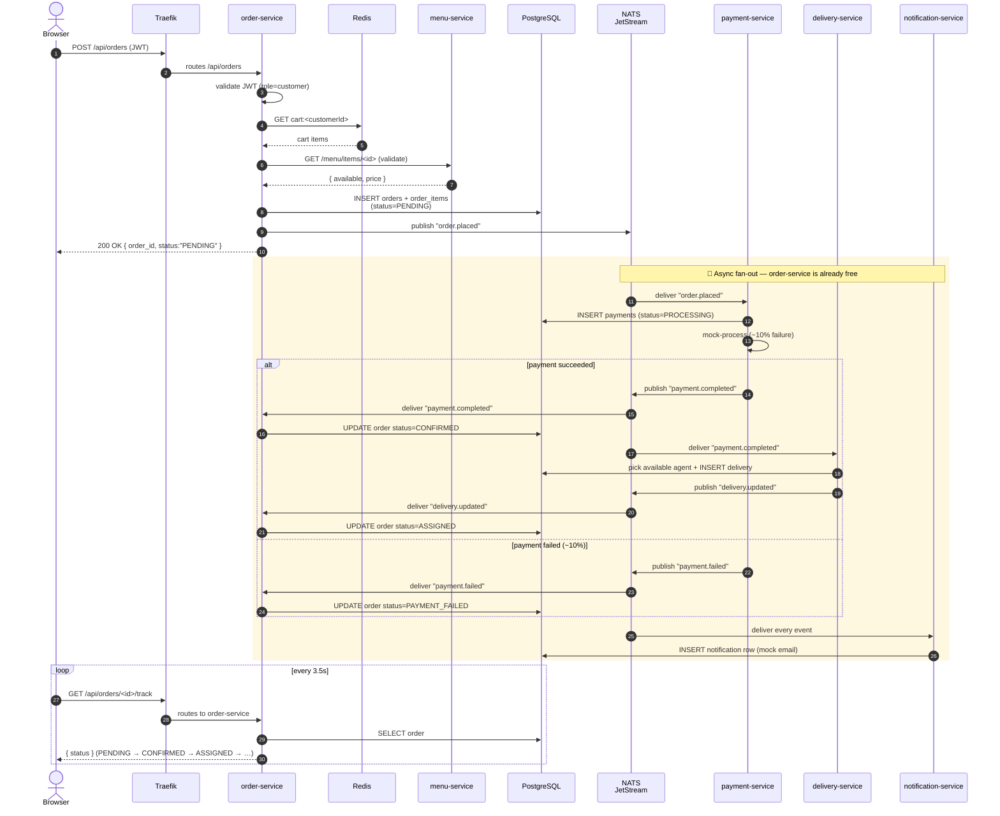
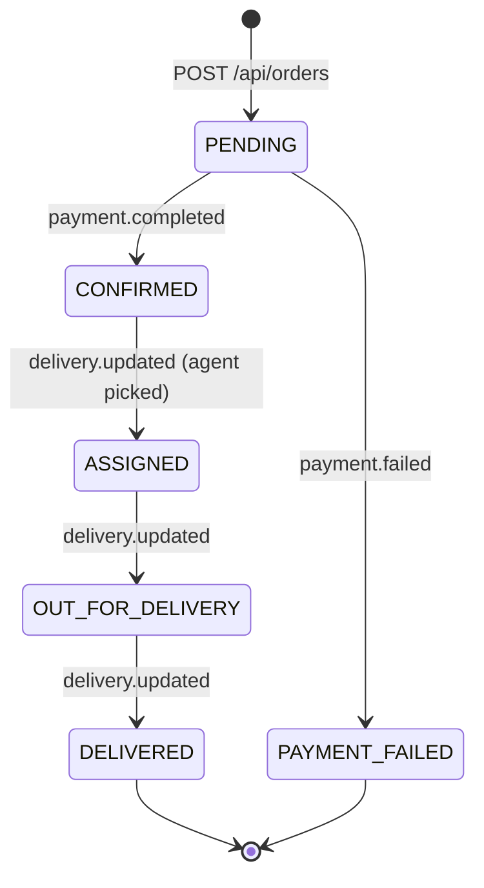
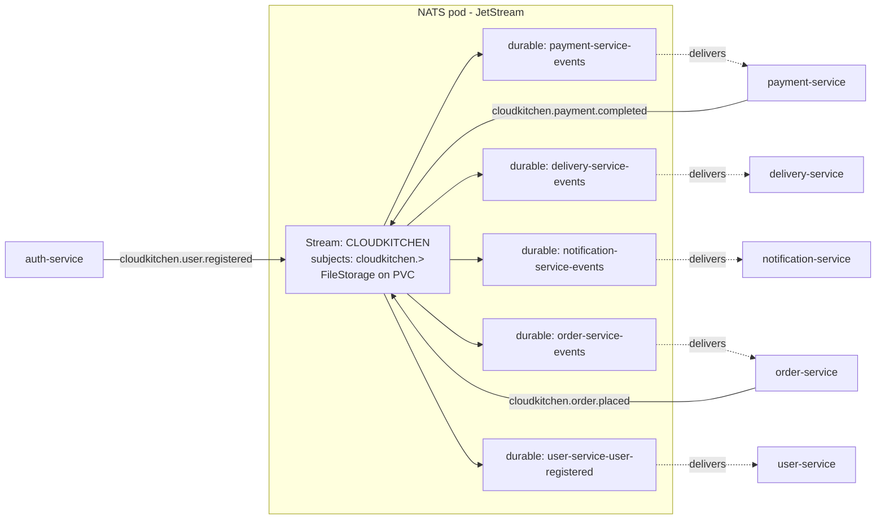
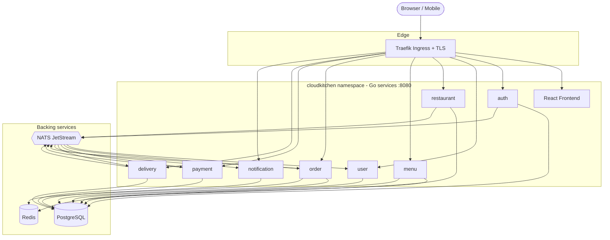

# 🍳 CloudKitchen — Architecture Overview

> A **"start here"** explanation of what this project is and how the pieces
> fit together. If you've never seen this repo before, **read this page first**.

---

## 1. What is CloudKitchen?

CloudKitchen is a **cloud-native, microservice-based food-delivery platform** —
think a stripped-down Swiggy / DoorDash. It's built as a **portfolio / learning
project** that demonstrates how a real production system is structured: many
small services talking to each other, deployed to Kubernetes, with proper
observability, CI/CD, and GitOps.

**The user-visible flow it implements end-to-end:**

```
  Customer signs up → browses restaurants → adds dishes to cart
  → places an order → payment is processed (mock) → an agent is assigned
  → order moves through statuses → notifications are logged
```

…and every step of that happens through **separate, independent services**
that talk to each other over the network.

---

## 2. The 9 application services (what each one does)

8 Go backend services + 1 React frontend. **Every backend service listens on
port 8080 inside its container** and exposes `/healthz`, `/readyz`, and
`/metrics`.

| # | Service | Language | Job |
|---|---------|----------|-----|
| 1 | **frontend** | React + Vite + nginx | The web UI you see in the browser. Also acts as a local API gateway in docker-compose. |
| 2 | **auth-service** | Go (Gin) | Registration, login, JWT issuance, role checks (`customer`, `restaurant-admin`, `delivery-agent`, `admin`). |
| 3 | **user-service** | Go (Gin) | User profiles and delivery addresses. |
| 4 | **restaurant-service** | Go (Gin) | Restaurants — create, list, fetch. |
| 5 | **menu-service** | Go (Gin) | Categories, menu items, food search (Redis-cached). |
| 6 | **order-service** | Go (Gin) | Cart (in Redis) and orders (in Postgres). The heart of the system. |
| 7 | **payment-service** | Go (Gin) | Mock payment processing (~10% simulated failure for realism). |
| 8 | **delivery-service** | Go (Gin) | Assigns delivery agents, updates delivery status. |
| 9 | **notification-service** | Go (Gin) | Logs notifications (email-style mock). |

## 3. The 3 backing services (data + messaging)

| # | Component | Why |
|---|-----------|-----|
| 1 | **PostgreSQL** | The system of record. One database (`cloudkitchen`) with a **schema per service** (`auth`, `users`, `restaurants`, `menu`, `orders`, `payments`, `delivery`, `notifications`) — each service owns its tables, nobody else touches them. |
| 2 | **Redis** | Fast in-memory cache. Used by `menu` (search results) and `order` (the cart). |
| 3 | **NATS (JetStream)** | The **event bus**. Lets services talk to each other **asynchronously** — see Section 5. |

---

## 4. The two ways services talk: **Sync** vs **Async**

Microservices need to communicate. Two patterns:

### 🔁 Synchronous (REST over HTTP)

Used when a service needs an **immediate answer** from another service.



In CloudKitchen, sync calls are few:
- `order` → `menu` (validate items in the cart before placing the order)
- `order` → `restaurant` (validate the restaurant exists)

That's it. Almost everything else uses **events**.

### 📨 Asynchronous (NATS events)

Used for **fire-and-forget** notifications — when the publisher doesn't need a
reply, and multiple consumers may care.



The publisher returns the moment NATS has stored the event. Consumers process
it on their own time. **Adding a new consumer (e.g. analytics) doesn't require
any change to the publisher** — that's the whole point.

### Side-by-side: when to use which

| | Synchronous (REST) | Asynchronous (NATS) |
|---|---|---|
| Used for | "I need an answer to continue" | "FYI, something happened" |
| Publisher blocks? | yes, waits for reply | no, fire-and-forget |
| 1 consumer or many? | exactly one | any number |
| If consumer is down | call fails | event waits in JetStream, replays |
| Adds coupling? | yes (knows the URL) | no (knows the subject) |
| Examples in our app | order → menu validation | order → payment / delivery / notification |

---

## 5. The 6 events and who handles them

Every service can be a **publisher** of some events and a **consumer** of others.
Visual overview:



🟧 = also publishes events   🟦 = only consumes

The same data, as a table:

| Event | Published by | Consumed by | Meaning |
|---|---|---|---|
| `user.registered` | auth | user, notification | New account created |
| `restaurant.created` | restaurant | notification | New restaurant onboarded |
| `order.placed` | order | payment, notification | Customer submitted an order |
| `payment.completed` | payment | order, delivery | Payment succeeded → fulfil + dispatch |
| `payment.failed` | payment | order, notification | Payment failed → cancel + notify |
| `delivery.updated` | delivery | order, notification | Delivery status changed |

> **Naming convention:** internally these events are NATS subjects under the
> `cloudkitchen.` prefix (e.g. `cloudkitchen.order.placed`). The broker code
> prepends that prefix automatically — service code uses just the bare name.

---

## 6. End-to-end walkthrough: "Place an order"

The single best way to understand the architecture is to follow one request.
The diagram below shows **every actor**, **every wire** and **what's sync vs
async** in a single order's life:



**Note what doesn't happen:** order-service **never directly calls** payment /
delivery / notification. It just publishes an event and gets on with its day.
That's the whole point of NATS — services are **decoupled in time** (they don't
have to be up at the same instant) and **decoupled in knowledge** (no service
knows the URL of any other downstream service).

---

## 6a. Order lifecycle (state machine)

While the events are flowing, here's how the **order's `status` column** moves:



So when the frontend polls `/api/orders/<id>/track`, it sees the status walk
through these stages — that's what powers the animated "scooter on a track"
UI on the OrderTracking page.

## 6b. NATS JetStream internals (what's inside that 📨 box)

JetStream is what gives us **at-least-once delivery + persistence + replay**.
Inside the single NATS pod:



Key bits:
- **One stream** (`CLOUDKITCHEN`) holds **every** event under the `cloudkitchen.>` wildcard.
- **One durable consumer per service** — bookmarks where that service has acked up to. If the service restarts, it resumes from the last ack, **not** the start.
- **AckExplicit + MaxDeliver = 2** — on handler error, JetStream retries **once**, then drops the message (poison-message safe).

## 7. The full architecture diagram



---

## 8. Tech stack at a glance

| Layer | Technology |
|---|---|
| Backend services | **Go 1.23** + Gin framework |
| Frontend | **React 18 + Vite**, served by **nginx** |
| Database | **PostgreSQL 16** (schema-per-service) |
| Cache | **Redis 7** (cart, menu search) |
| Event bus | **NATS 2.10 + JetStream** (at-least-once, file-persisted) |
| Containers | **Docker** (per-service Dockerfile, non-root distroless images) |
| Local dev | **docker-compose** (the entire stack on your laptop) |
| Orchestration | **Kubernetes** (GKE / EKS) |
| Ingress | **Traefik** (Helm chart) |
| Packaging | **Helm** (one umbrella chart for everything) |
| IaC | **Terraform** (`gcp-terraform/` for GCP, `terraform/` for AWS) |
| Image registry | **GCP Artifact Registry** (`cloudkitchen-registry`) / AWS ECR |
| CI | **GitHub Actions** (matrix build → Trivy scan → push → values bump) |
| CD / GitOps | **ArgoCD** (no `helm upgrade` in CI; ArgoCD reconciles Git → cluster) |
| TLS | **cert-manager** + Let's Encrypt |
| Metrics | **Prometheus** (kube-prometheus-stack) + **Grafana** |
| Logs | **Loki** + **Promtail** |
| Security scan | **Trivy** (HIGH/CRITICAL gate in CI) |

---

## 9. Where things live in the repo

```
cloudkitchen-app/
├── auth-service/  user-service/  restaurant-service/  menu-service/    ← 8 Go services
│   order-service/ payment-service/ delivery-service/ notification-service/
│   └── each:  cmd/  internal/{handler,service,repository,model,middleware}/
│              pkg/broker/  migrations/  Dockerfile  go.mod
│
├── frontend/                 React + Vite SPA + nginx (also acts as local /api gateway)
├── helm/cloudkitchen/        Single umbrella Helm chart that deploys ALL 12 things
├── terraform/                AWS EKS infrastructure (VPC / EKS / ECR / IAM)
├── gcp-terraform/            GCP GKE infrastructure (VPC / Artifact Registry / firewall)
├── argocd/                   ArgoCD Application + AppProject manifests
├── monitoring/               Prometheus values, ServiceMonitors, PrometheusRules, Grafana dashboards
├── logging/                  Loki + Promtail values
├── security/                 cert-manager, NetworkPolicies, PSS docs, Trivy notes
├── docker/                   docker-compose.yml for full local stack
├── docs/                     architecture docs + step-by-step EKS deploy runbooks
└── .github/workflows/        CI pipeline (build, Trivy, push, GitOps bump)
```

---

## 10. Design choices worth highlighting

| Choice | Why |
|---|---|
| **Schema-per-service in one DB** instead of DB-per-service | Cheaper to run (one Postgres pod), still enforces "no cross-service joins" via separate schemas. Easy to split later. |
| **NATS JetStream** instead of RabbitMQ / Kafka | Lightest broker that still gives at-least-once delivery. Single Go binary, ~30 MB RAM, no Erlang VM or Zookeeper. |
| **Single umbrella Helm chart** | One `helm install` brings up *everything* (8 services + frontend + Postgres + Redis + NATS + IngressRoute). One values.yaml to edit. |
| **Traefik over nginx-ingress** | Native `IngressRoute` CRD + middleware composition is cleaner than annotation-driven nginx. |
| **GitOps via ArgoCD** (not `helm upgrade` in CI) | Cluster state == Git. Roll back = revert a commit. No imperative `kubectl` from CI runners. |
| **Distroless, non-root images** | Smaller (~17 MB Go images, ~63 MB nginx frontend), fewer CVEs (no shell, no package manager). |
| **Both AWS and GCP terraform** | You can deploy to either cloud — `terraform/` (EKS) or `gcp-terraform/` (GKE). Helm chart is cloud-agnostic. |

---

## 11. How a new contributor onboards (recommended reading order)

1. **This file** — you're already here. ✓
2. [`docker/README.md`](../docker/README.md) — run the whole stack locally with `docker compose`.
3. [`helm/cloudkitchen/README.md`](../helm/cloudkitchen/README.md) — what the chart deploys + every Helm command.
4. [`docs/eks/README.md`](eks/README.md) — the 7-phase deployment runbook (works for GKE too, with minor cloud-specific tweaks).
5. Pick any service (e.g. `order-service/`) and trace one Publish / Consume call.

---

## TL;DR

CloudKitchen is **9 small services + 3 backing stores**, packaged in **one Helm
chart**, deployed to **GKE/EKS** via **Terraform + ArgoCD**. Services talk
**synchronously over REST** for queries, and **asynchronously via NATS
JetStream events** for everything that fans out (orders → payment, delivery,
notification). One database with one schema per service. Distroless containers.
GitOps end-to-end.

That's the whole picture.
